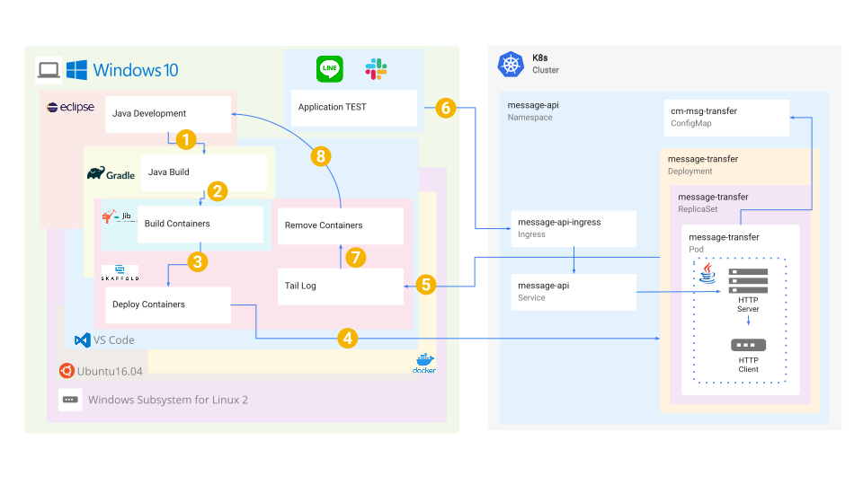

# message-api

LineとSlackで相互にメッセージを送受信するためのK8sアプリケーション

## スタートガイド

このアプリケーションの構成例です。
点線の中身が実際のアプリケーションです。


### 必要条件

[Slack API](https://api.slack.com/) と [LINE API](https://developers.line.biz/ja/docs/messaging-api/)
を設定して、下記の値を取得します。

>SLACK_WEBHOOK_CONTEXT = [${ Slackからメッセージを受信するURLのPATH }](https://api.slack.com/events-api#request_url_configuration__amp__verification)  
>SLACK_TARGET_CHANNEL = [${ 受信対象のSlackチャンネル }](https://api.slack.com/events/message.channels)  
>SLACK_TARGET_USER = [${ 受信対象のSlackユーザ }](https://api.slack.com/events/message.channels)  
>SLACK_API_URL = [${ Slackへメッセージを送信するWebhookのURL }](https://api.slack.com/messaging/webhooks#create_a_webhook)  
>LINE_WEBHOOK_CONTEXT = [${ LINEからメッセージを受信するURLのPATH }](https://developers.line.biz/ja/docs/messaging-api/receiving-messages/)  
>LINE_WEBHOOK_CHANNEL_SECRET = [${ メッセージ認証コードの秘密鍵 }](https://developers.line.biz/ja/glossary/#channel-secret)  
>LINE_TARGET_GROUP_ID = [${ 受信対象のLINEグループ }](https://developers.line.biz/ja/reference/messaging-api/#source-group)  
>LINE_TARGET_USER_ID = [${ 受信対象のLINEユーザ }](https://developers.line.biz/ja/reference/messaging-api/#source-group)  
>LINE_API_URL = [${ LINEへメッセージを送信するAPIのURL }](https://developers.line.biz/ja/reference/messaging-api/#http%E3%83%AA%E3%82%AF%E3%82%A8%E3%82%B9%E3%83%88-7)  
>LINE_API_TOKEN = [${ LINEへメッセージを送信するAPI利用時に使用するトークン }](https://developers.line.biz/ja/glossary/#channel-access-token)  

<details><summary>取得した値を ConfigMap に設定します。</summary><div>

```yaml:k8s/msg-transfer.yaml
---
apiVersion: v1
kind: ConfigMap
metadata:
  namespace: message-api
  name: cm-msg-transfer
  labels:
    app: message-transfer
data: ### Setting for your environment
  SLACK_WEBHOOK_CONTEXT = ${ Slackからメッセージを受信するURLのPATH }
  SLACK_TARGET_CHANNEL = ${ 受信対象のSlackチャンネル }
  SLACK_TARGET_USER = ${ 受信対象のSlackユーザ }
  SLACK_API_URL = ${ Slackへメッセージを送信するWebhookのURL }
  LINE_WEBHOOK_CONTEXT = ${ LINEからメッセージを受信するURLのPATH }
  LINE_WEBHOOK_CHANNEL_SECRET = ${ メッセージ認証コードの秘密鍵 }
  LINE_TARGET_GROUP_ID = ${ 受信対象のLINEグループ }
  LINE_TARGET_USER_ID = ${ 受信対象のLINEユーザ }
  LINE_API_URL = ${ LINEへメッセージを送信するAPIのURL }
  LINE_API_TOKEN = ${ LINEへメッセージを送信するAPI利用時に使用するトークン }
```
</div></details>

## デプロイ

下記のコマンドで Kubernetes Cluster へデプロイします。
```
kubectl apply -f k8s/cert-manager/letsencrypt-clusterissuer.yaml
kubectl apply -f k8s/ingress-nginx-production.yaml
kubectl apply -f k8s/msg-transfer.yaml
```

## 開発

このアプリケーションを開発した環境です。

① Java Development
[Pleiades All in One Eclipse](https://mergedoc.osdn.jp/)

② Java Build
```
./gradlew delJib clean build jib
```

③ Build Containers
④ Deploy Containers
⑤ Tail Log
```
skaffold dev
```
⑥ Application TEST
LINEやSlackでメッセージ送受信を実行

⑦ Remove Containers
```
CTRL + C
```

## ライセンス

このプロジェクトは Apache License, Version 2.0 ライセンスの元にライセンスされています。   
詳細は [LICENSE.md](LICENSE.md) をご覧ください。
